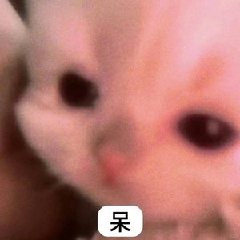
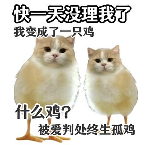
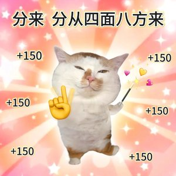

**[中文版 README](./README_zh.md)**

# sticker-reply-skill

Make your AI assistant chat like a real friend — with stickers.

A skill/prompt system that teaches AI assistants (Claude, GPT, etc.) to automatically select and send stickers based on conversation emotion, intent, and context.

## What is this?

Instead of cold text-only replies, your AI assistant will:
- Send a cute cat sticker when you say "thanks"
- Reply with just a sticker when you say "haha"
- Mix text + stickers naturally like a real friend
- Control sticker frequency (~30-40% of replies)
- Match sticker emotion to conversation context

## Quick Start

### 1. Copy the skill prompt

Add the content of [`SKILL.md`](./SKILL.md) to your AI assistant's system prompt.

### 2. Load the sticker index

Point your assistant to `stickers/index.json` so it knows what stickers are available.

### 3. Handle sticker markers

When the AI wants to send a sticker, it outputs markers like `[sticker:stk_001]`. Your application should:
1. Parse these markers from the response
2. Look up the sticker file from `index.json`
3. Send the image to the user

## Pre-loaded Stickers

This repo includes **107 pre-loaded stickers** (cute cats!) across multiple emotion categories:

| Category | Count | Use case |
|---|---|---|
| `positive` | 16 | Happy, friendly, cute |
| `playful` | 45 | Funny, teasing, sassy |
| `encouraging` | 6 | Support, cheer up |
| `grateful` | 11 | Thanks, appreciation |
| `negative` | 16 | Sad, angry, crying |
| `disgusted` | 9 | Speechless, sarcasm |

> **Important**: The pre-loaded sticker images are sourced from Xiaohongshu for demonstration purposes only. They are intended for personal learning and familiarization with the skill system. **Please delete them after testing and replace with your own sticker collection.**

### Preview

| Positive | Playful | Encouraging |
|---|---|---|
|     |     |    |

## Sticker Index Schema

Each sticker in `stickers/index.json`:

```json
{
  "filename": "playful_cat_wait_reply_01.jpg",
  "emotion": "playful",
  "description": "cat waiting for reply",
  "tags": ["waiting", "reply", "where are you"],
  "scene": ["user hasn't replied", "waiting for response"],
  "intensity": "medium",
  "reply_mode": "either"
}
```

| Field | Description |
|---|---|
| `emotion` | positive, playful, encouraging, grateful, confused, surprised, disgusted, sad, negative, shy, angry, neutral |
| `intensity` | light / medium / strong |
| `reply_mode` | solo (sticker only), with_text, either |
| `tags` | Keywords the **user** might say (triggers) |
| `scene` | When to use this sticker |

## Building Your Own Library

### Recommended size: 40-60 stickers

| Emotion | Count |
|---|---|
| positive | 8-10 |
| playful | 8-10 |
| encouraging | 4-5 |
| grateful | 3-4 |
| confused | 3-4 |
| surprised | 3-4 |
| disgusted | 3-4 |
| sad | 2-3 |
| shy | 2-3 |
| neutral | 2-3 |

### Image requirements
- **Size**: 300x300px recommended
- **Format**: JPEG, quality 85
- **File size**: < 25KB (for instant display in chat apps)
- **Naming**: `{emotion}_{description}_{number}.jpg`

## Integration Examples

### With Claude Code (PTY + MCP)

Used in [wechat-claude](https://github.com/Zhanglala103838/wechat-claude) — a WeChat-to-Claude bridge that sends stickers via MCP tools.

### With any AI assistant

1. Include `SKILL.md` in system prompt
2. Append available sticker list from `index.json`
3. Parse `[sticker:xxx]` from AI response
4. Send corresponding image

## License

MIT License. See [LICENSE](./LICENSE).

**Note on pre-loaded images**: The included sticker images are from Xiaohongshu, sourced for demonstration only. Please replace with your own images for production use.
